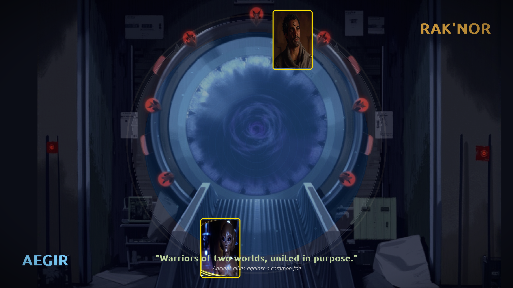
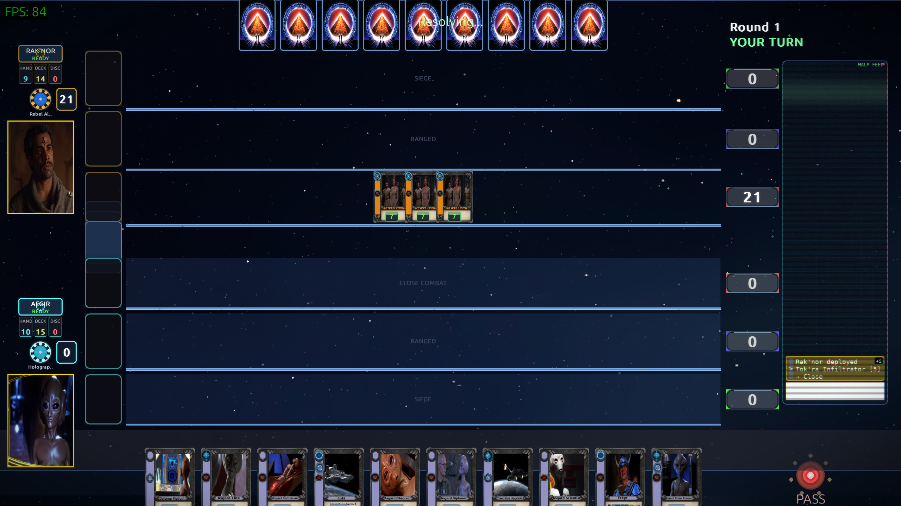
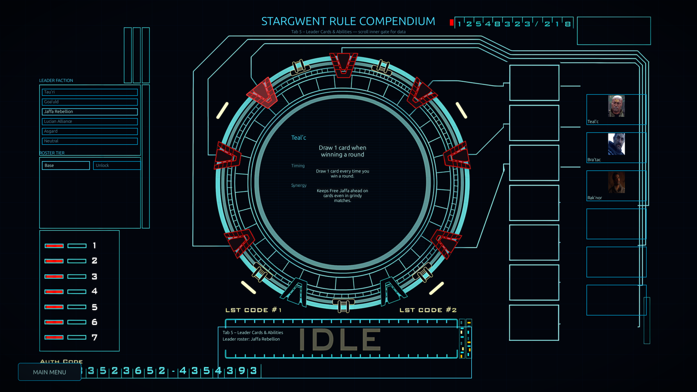
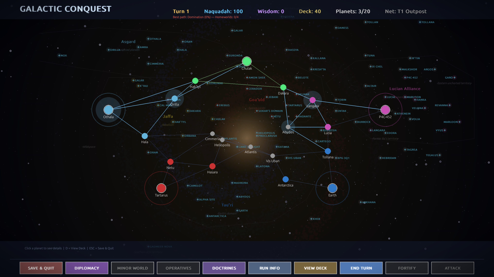
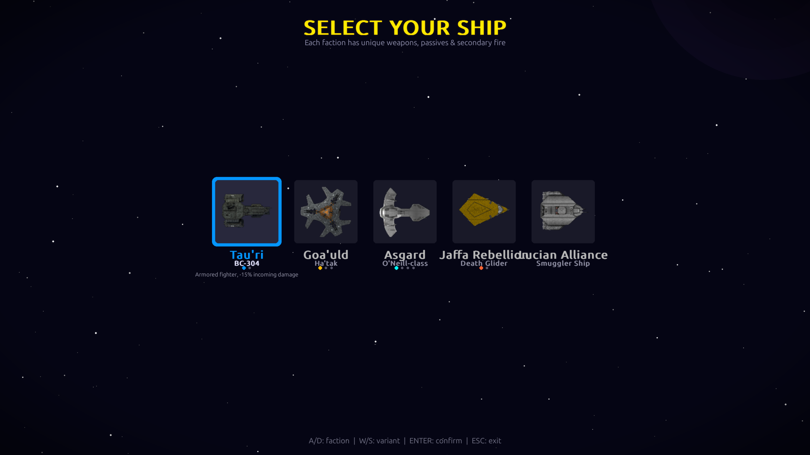

# Stargwent 🌌⚡

**A Gwent-style card game set in the Stargate SG-1 universe**

Battle with iconic characters and technology from the Tau'ri, Goa'uld, Jaffa, Lucian Alliance, and Asgard in this strategic card game featuring stunning visual effects, comprehensive progression system, and full deck customization!

---

## ⚠️ Fan Project Disclaimer

**This is a non-commercial fan project created purely out of love for two amazing franchises:**

- **Stargate SG-1** - The legendary sci-fi series by MGM that brought us the Stargate universe
- **Gwent** - The brilliant card game from CD Projekt Red's The Witcher 3: Wild Hunt

**No copyright infringement is intended.** This project is a tribute and fan service to both franchises. We do not claim ownership of any Stargate or Gwent intellectual property. This is an educational hobby project made by fans, for fans, with no commercial purpose whatsoever.

*Indeed.* - Teal'c

---

<!-- VERSION: Update this badge to change the version everywhere (README, .deb package, GitHub) -->

-purple)

---

## 📋 Table of Contents

- [📸 Screenshots](#-screenshots)
- [✨ Key Features](#-key-features)
- [🚀 Quick Start](#-quick-start)
- [🎮 How to Play](#-how-to-play)
- [🎴 Factions & Leaders](#-factions--leaders)
- [⚡ Faction Powers](#-faction-powers)
- [🃏 Card Abilities](#-card-abilities)
- [🏆 Progression System](#-progression-system)
- [🎨 Visual Features](#-visual-features)
- [⌨️ Controls](#️-controls)
- [🌐 LAN Multiplayer Architecture](#-lan-multiplayer-architecture)
- [📊 Implementation Status](#-implementation-status)
- [🏗️ Project Structure](#️-project-structure)
- [🔧 Technical Details](#-technical-details)
- [🌐 Play in Browser (PWA)](#-play-in-browser-pwa)
- [🛠 Build & Packaging](#-build--packaging)
- [📜 Rules Spec Generator](#-rules-spec-generator-auto-detection)
- [🛠️ Content Manager](#️-content-manager-developer-tool)
- [📝 License & Credits](#-license--credits)

---

## 📸 Screenshots

| | |
|:---:|:---:|
|  |  |
| *Main Menu — Stargate border with DHD buttons* | *Faction Selection — Choose your army* |
|  |  |
| *Leader Matchup — Stargate event horizon intro* | *Mulligan Phase — Redraw 2-5 cards* |
|  |  |
| *Card Battle — Full board with MALP history panel* | *Deck Builder — Stargate-framed card inspector* |
|  |  |
| *Draft Mode — Pick your leader for the gauntlet* | *Rule Compendium — Interactive Stargate terminal* |
|  |  |
| *Galactic Conquest — Galaxy map with 20+ planets* | *LAN Multiplayer — Host or join with room codes* |
|  | |
| *Space Shooter — Pick your faction ship* | |

---

### ✨ Key Features

### 🎮 Complete Card Game Experience
- **100% Fully Implemented** - All mechanics, powers, animations, persistence, LAN multiplayer, and Draft Mode
- **247 Cards** across 5 factions + Neutral cards with 20+ Stargate-themed abilities
- **35 Unique Leaders** (15 base + 20 unlockable) each with special abilities
- **25+ Hero Animations** - Unique cinematic entry effects for legendary commanders
- **Legendary Commander Voice Clips** - Character quotes play when heroes are deployed
- **Granular Audio Control** - 4 volume sliders (Master, Music, Voice, Effects) — master applies as multiplier. Card effect animations (Replicator Swarm, Asgard Beam, etc.) use **Effects** slider; Commander voice snippets use **Voice** slider. All game sounds respect settings including space shooter SFX

### 🎨 Stargate-Authentic UI
- **MALP Feed History Panel** - Military monitor aesthetic with scan-lines, score delta badges, turn numbers, round separators, and latest-entry pulse
- **DHD Buttons** - Authentic Dial Home Device styling with glowing chevrons and cyan crystals
- **Iris Defense Overlay** - Metallic titanium shutter pattern when Tau'ri shield is active
- **Retro Neon Leader Nameplates** - Cyberpunk font with faction-colored glow and scanlines
- **Witcher 3 Gwent Layout** - Authentic board design with clear lane separation

### ⚔️ Deep Strategic Gameplay
- **Elite AI Opponent** - Hero preservation, Round 2 bleeding tactics, strategic faction power usage
- **Precise Card Placement** - Drop cards between existing units for tactical positioning
- **5 Unique Faction Powers** - Once-per-game abilities with cinematic animations
- **Interactive Abilities** - Medical Evac and Ring Transport with full selection UI

### 🏆 Draft Mode (Roguelike Gauntlet)
- **8-Win Challenge** - Survive increasingly difficult AI opponents
- **Cross-Faction Drafting** - Build decks from ALL factions (30 cards, pick 1 of 3)
- **Redraft Milestones** - At 3 wins: redraft 5 cards. At 5 wins: redraft your leader
- **Synergy Scoring** - Cards highlight when they combo with your current deck
- **Save & Continue** - Progress persists between sessions

### 🚀 Space Shooter Easter Egg (Vampire Survivors-Style Infinite Survival)
- **Unlocked at 8 Draft Wins** - Beat the gauntlet to unlock a full arcade mini-game
- **Infinite Survival Mode** - No wave limit! Camera follows your ship through an endless procedurally-spawning world with time-based difficulty scaling (10 tiers from "Calm" to "Beyond")
- **5 Factions, 12 Playable Ships** - Each faction has a base ship + 1-3 alternate variants with unique weapons, secondaries, and passives. Up/Down to pick variant in ship select
- **Alt Ships**: Asgard Valhalla-class (plasma lance + heavy armor), Beliskner-class (beam + transporter), Research Vessel (disruptor + sensor sweep), Goa'uld Apophis Flagship (dual staff + ribbon blast), Anubis Mothership (Eye of Ra beam), Tau'ri Aurora-class (Ancient drone pulse + fast shields), Jaffa Ha'tak Refit (rally allies + symbiote resilience)
- **Secondary Fire per Faction** - Tau'ri Railgun, Goa'uld Staff Barrage, Asgard Ion Pulse, Jaffa War Cry, Lucian Scatter Mines + variant-specific abilities (Transporter Beam, Sensor Sweep, Ribbon Blast, Asgard Beam, Eye of Ra, Jaffa Rally)
- **Supergate Boss Events** - At 3 minutes, a single destroyable Supergate materializes with full kawoosh vortex animation; song plays when gate opens. Bosses emerge one at a time (Ori Mothership: 20000 HP + 10000 shields, golden sweeping beam / Wraith Hive: 16000 HP + 6000 shields, purple life-drain beam). Gate stays open until ALL bosses spawned AND killed. Destroying the gate prevents remaining bosses. Damageable by projectiles, asteroids (500 dmg), and wormhole vortex (2000 dmg) — immune to touch contact. Boss events never stack. Waves escalate!
- **Faction-Styled Thrusters** - Unique engine particle effects per faction (Tau'ri blue-white, Goa'uld fiery gold, Asgard cyan diamonds, Jaffa hot orange, Lucian purple/pink) with SHIFT boost
- **Buttery Smooth Movement** - Velocity-based acceleration with friction, diagonal normalization, and thruster speed boost
- **Wormhole Escape** - Press Q to vanish through a wormhole with siege.ogg sound effect, bigger gravity pull radius
- **Level 20 Primary Fire Mastery** - At level 20, your weapon auto-evolves with a unique mastery: Overcharged Beam (wider + burn DoT), Plasma Detonation (120px AoE), Cascade Disruption (3 fragments), Focused Optics (full pierce), Staff Barrage (4 staffs), MIRV Warhead (3 homing sub-missiles), Drone Swarm (extra drones), Kree's Judgement (every 5th shot 3x), Unstable Naquadah (trail damage)
- **26 Upgrades (4 Rarities)** - Common, Rare, Epic, and Legendary upgrades including 5 Evolution combos (Thor's Hammer, Bullet Hell, Black Hole, Ancient Outpost, Cluster Bomb)
- **18 Power-Up Types** - 8 generic (Shield, Rapid Fire, Drone Swarm, Naquadah Core, Cloak, Overcharge, Time Warp, Magnetize) + 10 faction-specific (Epic & Legendary) with rarity glow effects
- **Multi-Directional Fire** - Multi-Targeting upgrade fires in all 4 quadrants at higher stacks
- **15 Enemy Types** - Regular, Fast, Tank, Elite, Kamikaze + Stargate-themed (Wraith Dart, Replicator, Ori Fighter, Ancient Drone, Death Glider, Al'kesh Bomber, Wraith Miniship, Wraith Hive mini-boss, Ori Mothership boss, Wraith Supergate boss)
- **Carrier-Style Miniship Escorts** - Tau'ri, Goa'uld, and Wraith players unlock autonomous interceptor miniships (StarCraft Carrier-inspired): orbit in formation, sortie to attack with smooth lerp movement, respawn on destruction. Native 120x120 sprites at x1 scale. Scales from 2 escorts at level 3 to 5 at level 15. Escort Overdrive and Escort Shields powerups
- **Wraith Miniship Enemies** - Hostile-all cruisers that attack both the player and other enemies, spawning in pairs from tier 5+
- **LAN Co-op Parity** - Full crossplay between host and client: alt ship variants, supergate boss events, asteroids, beam damage, boss rewards, per-player revival invulnerability, proximity mines, ion pulse effects, and miniship escorts all synced across both players with client-side entity interpolation
- **Co-op Revival** - When a player dies, their partner's next kill revives them at the partner's position with 50% HP/shields and 3 seconds of per-player invulnerability (blocks all damage: projectiles, beams, contact, bombs)
- **Background Music & SFX** - Looping soundtrack, per-faction enemy hit sounds, shield hit feedback, per-faction + per-variant thruster boost sounds, per-variant secondary fire sounds, cloak activation sound, supergate activation sound, Ori beam + Wraith beam boss sounds — all controlled by Master/Effects volume sliders. Audio cuts off immediately on game exit
- **Asteroid Field Events** - Periodic dense asteroid waves from a random direction with 3-second warning, escalating density and duration, navigate or destroy to survive
- **Visual Juice** - Infinite parallax starfield, faction-colored engine trails, damage numbers, screen shake, kill streak counter, mini-radar, popup notifications, Supergate kawoosh particle effects
- **Per-Session Leaderboard** - Scores accumulate across restarts, reset on exit

### 🌌 Galactic Conquest (Roguelite Campaign)
- **Territory Conquest**: Conquer a galaxy of 20+ planets through card battles across 5 faction territories
- **Roguelite Deck Progression**: Draft cards from defeated factions, upgrade card power, trim weak cards
- **Customize Your Run**: Choose friendly factions, neutral event count, enemy leaders, and difficulty before starting
- **4 Difficulty Levels**: Easy / Normal / Hard / Insane — scaling counterattack chance, starting naquadah, AI power, and loss penalties
- **4 Victory Conditions**: Domination (capture all homeworlds), Ascension (Ancient wisdom), Galactic Alliance (diplomacy), Stargate Supremacy (network + Supergate wonder) — plus Score Victory at turn 30 fallback
- **Minor Worlds**: 9 neutral planets become persistent diplomatic actors with influence (0-100), ally exclusivity, quests, and type bonuses (Scientific, Militant, Diplomatic, Economic, Spiritual)
- **Doctrine Trees**: Wisdom resource funds 5 policy trees (Ascension, Conquest, Alliance, Shadow Operations, Tech Innovation) — 4 sequential policies + completion bonus per tree, forcing strategic identity per run
- **Tok'ra Operatives**: Espionage system with operative lifecycle (deploy → establish → active), 6 mission types (Infiltrate, Sabotage, Steal Intel, Rig Influence, Coup, Counter-Intel), rank progression, and diplomatic incident risk
- **Stargate Network**: Connected planet count determines network tier (Outpost → Regional → Sector → Quadrant → Galactic) with scaling bonuses — naquadah income, cooldown reduction, attack range, and leader ability level
- **35 Conquest Leader Abilities**: Every leader has a unique conquest ability (L1-L4) that scales with network tier — O'Neill's MacGyver Protocol, Carter's Naquadah Generator, Ba'al's Clone Network, Thor's Asgard Fleet, and 31 more
- **Diplomacy System**: Faction relations from HOSTILE to ALLIED — trade agreements (50 naq), alliances (100 naq + shared adjacency), betrayals (+80 naq, permanent hostility)
- **5 Planet Buildings**: Naquadah Refinery, Training Ground, Shipyard, Sensor Array, Shield Generator — 1 per planet
- **Supply Lines**: Planets disconnected from homeworld are unsupplied (-50% income, +20% counterattack, no fortification)
- **18 Stargate Relics**: Combat, Economy, and Exploration relics — homeworlds award guaranteed faction relics
- **18 Planet Passives**: Owned planets grant bonuses — Earth +15 naq/turn, Atlantis +1 card choice, and more
- **20 Neutral Events**: Trader caravans, Nox Sanctuary, Tollan Ion Cannons, Ori Supergates, Pegasus Expeditions, and more
- **5 Crisis Events**: Galaxy-wide disruptions after turn 5 — Replicator Outbreak, Ori Crusade, Galactic Plague, Ascension Wave, Wraith Invasion
- **6 Narrative Arcs**: Story chains tracking conquest sequences for relic and naquadah rewards
- **Fortification System**: Spend naquadah to fortify planets (max level 3) — fortified planets grant defense bonuses in battle
- **Elite Homeworld Defenders**: Homeworld attacks trigger dramatic elite screen; AI gets +2 power and +2 extra cards
- **AI Faction Wars**: AI factions attack each other's territory, creating a dynamic shifting galaxy
- **Meta-Progression**: Earn Conquest Points per run → unlock persistent perks (Extra Starting Card, Naquadah Boost, Veteran Recruits, Diplomatic Immunity, Ancient Knowledge)
- **Pre-Battle Preview**: ENGAGE/RETREAT screen showing forces, weather, and modifiers before every attack
- **Turn Summary**: Animated income breakdown showing passive, reactor, network, and building income
- **Campaign Persistence**: Auto-saves every turn; resume from exact state
- **CRT Terminal Menu**: Retro scanline aesthetic with pulsing amber title, unlocks screen with high scores

### 🌐 LAN Multiplayer
- **Full 2-Player Networked Gameplay** - Host/Join with deck selection and chat
- **Room Codes** - Share easy codes like "GATE-7K3M" instead of IP addresses
- **Tailscale Support** - Smart IP detection prioritizes VPN addresses for remote play
- **Rematch System** - Play again with new faction/leader or disconnect
- **Integrated Chat** - Press 'T' to chat, quick chat keys 1-0 (Stargate quotes!), message bubbles, opponent name display
- **Connection Quality** - Real-time latency indicator (green/yellow/red) in HUD
- **Thread-Safe Networking** - Socket lock protects all concurrent send/recv/close operations across reader, keepalive, and main threads; clean thread shutdown with join on disconnect
- **Game Action ACKs** - Every card play, pass, and ability sends a message ID; receiver confirms receipt with an acknowledgment
- **Reliable Connections** - JSON error recovery (10 consecutive), keepalive-aware disconnect detection, duplicate disconnect prevention, graceful shutdown

### 🌐 Play in Browser (PWA)
- **No Install Needed** - Play directly in your browser via Pygbag (Pygame→WASM)
- **1080p Resolution** - Full 1920x1080 rendering in browser with aggressive render caching for smooth performance
- **iOS Home Screen App** - Add to Home Screen in Safari for fullscreen landscape gameplay
- **Touch Controls** - Tap to select cards, long-press to inspect, drag to play, two-finger scroll
- **Virtual Joystick** - Space shooter plays with on-screen joystick + action buttons
- **WebGL 2.0 Shaders** - All 12 GPU effects (bloom, vignette, event horizon, etc.) ported to GLSL ES 3.0
- **Offline Play** - Service worker caches everything for offline use after first load
- **Persistent Saves** - Progress saved to IndexedDB, persists across browser sessions
- **Web-Safe Audio** - Battle music transitions use instant stop instead of fadeout to prevent Emscripten audio crashes

### ⌨️ Universal Controls
- **Full Keyboard Navigation** - Arrow keys, F to play, G for faction power, Tab to cycle
- **Row-Type Highlighting** - Cards glow red (close), blue (ranged), green (siege)
- **Mouse + Keyboard** - Drag-and-drop or keyboard-only gameplay
- **Touch (Mobile/Tablet)** - Tap, long-press, drag, and two-finger scroll with automatic gesture recognition

### 💾 Progression & Customization
- **Witcher-Style Deck Builder** - Accordion card pool, holographic stats, drag-and-drop
- **Card Unlock System** - Win games to unlock 20+ powerful cards
- **Leader Unlock System** - Win 3 in a row to unlock alternate faction leaders
- **Tabbed Stats Menu** - 6-tab layout (Overview, Factions, Leaders, Records, Draft, Conquest) with score records, win rate bars, achievements, and hover preview
- **Persistent Saves** - All progress saved to JSON

### 💾 Persistent Progression
- **Automatic Deck Saving** - Your deck is saved every time you finish customizing
- **Per-Faction Customization** - Each faction remembers your leader and deck choices
- **Win Tracking** - Track your wins, losses, and win streaks
- **Stats Menu** - Tabbed layout with independent scroll per tab, score records (highest/lowest/closest game with leader names), visual win rate bars, achievements, top leaders, matchups, and draft history
- **Leader Unlocks** - Earn new leaders every 3 consecutive wins
- **Cross-Session Saves** - All progress saved in `player_decks.json` and `player_unlocks.json`

### 🌌 Stargate Universe Integration
All abilities renamed and themed around Stargate lore:
- **Tactical Formation** - Unit coordination (was Tight Bond)
- **Gate Reinforcement** - Bring backup through the Stargate (was Muster)
- **Deep Cover Agent** - Tok'ra spies (was Spy)
- **Medical Evac** - Rescue fallen soldiers (was Medic)
- **Naquadah Overload** - Explosive destruction (was Scorch)
- **Ring Transport** - Asgard beam technology (was Decoy)
- **Command Network** - Tactical comms (was Commander's Horn)
- **Space Hazards** - Ice planets, nebulas, asteroid storms (was Weather)
- **Wormhole Stabilization** - Clear hazards with black hole animation!

### 🏆 Progression & Customization
- **Card Unlock System** - Win games to unlock 20+ powerful cards
- **Leader Unlock System** - Win 3 in a row to unlock faction leaders
- **Full Deck Builder** - Customize decks (25-40 cards, faction-specific unlocks)
- **Persistent Progress** - All unlocks saved to JSON
- **Win Streak Tracking** - Stats tracked across sessions
- **Faction-Specific Unlocks** - Leaders and cards match your chosen faction

## 🎮 How to Play

### Game Objective
**Win 2 out of 3 rounds** by having a higher total power than your opponent when both players pass.

### Game Flow

**1. Main Menu**
- **NEW GAME** - Start match with faction/leader selection
- **DECK BUILDING** - Customize decks for each faction
- **QUIT** - Exit game

**2. Faction & Leader Selection**
- Choose faction (each has unique playstyle)
- Select leader with special ability
- Review deck composition
- Start game

**3. Mulligan Phase (2-5 Cards)**
- Random coin flip determines who goes first
- LEFT CLICK to select 2-5 cards you want to redraw
- Click "CONFIRM MULLIGAN" button
- Must select at least 2 cards, maximum 5 cards
- AI automatically mulligans 2-4 cards

**4. Round Gameplay**
- Random player goes first (fair coin flip!)
- Each player starts with 10 cards
- Draw 2 cards at start of rounds 2 and 3
- Take turns playing one card at a time
- Pass when you want to stop (click DHD button!)
- Round ends when both players pass
- Player with highest power wins the round
- Press G or click Faction Power button (ONCE per game!)

**5. Victory & Rewards**
- First to win 2 rounds wins the game
- **Win any game** → Unlock 1 of 3 cards (faction-specific + Neutral)
- **Win 3 in a row** → Unlock alternate leader for that faction
- All progress saved automatically!

---

## 🎴 Factions & Leaders

### 5 Playable Factions

#### **Tau'ri** (Earth Forces) 🌎
*Human ingenuity and determination*
- **Style**: Balanced units, strong heroes
- **Leaders**: Col. O'Neill, Gen. Hammond, Dr. Carter, Dr. Jackson, Teal'c
- **Signature Twist**: Col. Jack O'Neill now summons a temporary 6-power clone at the start of every round—perfect disposable muscle that vaporizes after three of your turns.
- **Unlockable**: Jonas Quinn, Catherine Langford, Gen. Landry, Dr. McKay

#### **Goa'uld** (System Lords) 👑
*Ancient parasitic overlords*
- **Style**: Overwhelming numbers, powerful abilities
- **Leaders**: Apophis, Yu the Great, Sokar, Ba'al, Hathor
- **Apophis Ability**: If the enemy stacks 4+ ships in Siege, he beams one onto your board
- **Unlockable**: Ba'al (Clone), Cronus, Anubis, Kvasir

#### **Jaffa** (Free Jaffa Nation) ⚔️
*Warriors seeking freedom*
- **Style**: Tactical combat, unit synergy
- **Starter Leaders**: Teal'c, Bra'tac, Rak'nor
- **Unlockable**: Ka'lel, Gerak, Ishta, Rya'c (Teal'c's son)

#### **Lucian Alliance** (Pirates & Smugglers) 💀
*Cunning outlaws and mercenaries*
- **Leaders**: Varro, Sodan Master, Ba'al Clone
- **Unlockable**: Netan, Vala Mal Doran, Anateo, Kiva

#### **Asgard** (Ancient Allies) 👽
*Advanced technology and wisdom*
- **Leaders**: Thor, Freyr, Penegal, Aegir, Heimdall
- **Unlockable**: Thor (Supreme Commander), Hermiod, Loki

---

## ⚡ Faction Powers

**NEW in v0.6!** Each faction has a unique, **once-per-game** (not per-round!), cinematic ability called a **Faction Power** that doesn't consume your turn.

### 🌍 Tau'ri - "The Gate Shutdown"
**Effect:** Destroys the highest strength card on each of the opponent's rows.
**Visual:** Multiple fiery explosions on each row - white hot center → yellow → orange → red rings, followed by dark smoke debris particles.
**Strategy:** Surgical strike against opponent's strongest units. Best used when opponent has powerful cards spread across multiple rows. **Save for critical moment - only usable ONCE per game!**
**Activation:** Press **G** or click **ACTIVATE** button (Tab to select, SPACE to confirm)

### 🐍 Goa'uld - "Sarcophagus Revival"
**Effect:** Play two random non-Hero cards from your discard pile.
**Visual:** Golden energy stream radiating from the Goa'uld Leader card, sweeping over the discard pile. Two gold-tinged card sprites lift up and fly onto the battlefield.
**Strategy:** Massive card advantage and board recovery. Most effective when you have quality units in your discard pile. **Once per game - use wisely!**

### 🔫 Lucian Alliance - "Unstable Naquadah"
**Effect:** Deals 5 damage (strength reduction) to every non-Hero unit on the battlefield, friend or foe.
**Visual:** Sickly green pulse exploding outward from the center of the board with enhanced glowing particles and screen shake.
**Strategy:** Chaotic, high-risk ability. Use when you have fewer/weaker units than opponent, or when combined with Heroes (which are immune). **Once per game!**

### ⚔️ Jaffa Rebellion - "Rebel Alliance Aid"
**Effect:** Draw 3 cards from your deck, then discard 3 random cards to prevent hand overflow.
**Visual:** Enhanced Tel'tak ship with "JAFFA REINFORCEMENTS" title, stealth effects, and card delivery animation.
**Strategy:** Card cycling for tactical advantage. Useful when you need specific cards or want to refresh your hand options. **Once per game - timing is everything!**

### 👽 Asgard - "Holographic Row Swap"
**Effect:** Swap opponent's entire close combat row with their ranged row.
**Visual:** Blue transference lattice effect, screen vibrates, entire rows swap positions with holographic shimmer.
**Strategy:** Massive tactical disruption! Completely reverses opponent's row strategy. Units built for close combat are now in ranged (and vice versa). Destroys row-specific combos, horn placements, and weather strategies. **Once per game!**

---

## 🃏 Card Abilities

### Core Abilities

#### **Legendary Commander** 🌟
- Immune to ALL special effects
- Not affected by weather/hazards
- Cannot be targeted by most abilities
- Cannot be boosted by Command Network

#### **Tactical Formation** 🤝
- Multiple copies multiply each other's power
- Example: 3 cards with power 4 = 4×3 = 12 each (36 total!)

#### **Gate Reinforcement** 📢
- Automatically plays all copies from hand and deck
- All must go to same row
- Variants:
  - **Life Force Drain** - Steals power from opponent
  - **System Lord's Curse** - Weakens opponent units

#### **Deep Cover Agent** 🕵️
- Played on opponent's side
- You draw 2 cards (or 3 with faction/leader bonus!)
- Great for card advantage

#### **Medical Evac** ⚕️
- **Interactive!** Choose any non-Legendary unit from discard pile
- Full UI overlay shows available cards
- Immediately played to board

#### **Ring Transport** 🛸
- **Interactive!** Choose any non-Legendary unit from either board
- Returns card to YOUR hand (even opponent's!)
- Full UI with colored borders (blue=yours, red=theirs)

#### **Naquadah Overload** 🔥
- Destroys highest power non-Legendary units on the board
- Affects both players if tied
- **Blue energy explosions appear ONLY on rows where cards are destroyed**
- **Merlin's Weapon** variant - Only hits opponent!

#### **Command Network** 📯
- Doubles power of all non-Legendary units in a row
- Choose which row when playing

#### **Inspiring Leadership** 💚
- Boosts adjacent units in same row by +1
- Green aura animation

#### **Deploy Clones** 🛡️
- Summons 2 Clone Warriors (2 power each)
- Asgard technology
- Blue portal animation

#### **Activate Combat Protocol** ⚔️
- Summons 1 Combat AI (5 power)
- Advanced systems activation

#### **Survival Instinct** 😤
- Gains +2 power when weather affects their row
- Thrives in harsh conditions!

#### **Genetic Enhancement** ⚗️
- Transforms weakest unit in EACH row → 8-power warrior
- Gold transformation animation

### Special Card Abilities

#### **Thor's Hammer** ⚡
- Removes ALL Goa'uld units from both boards (instant purge)
- Asgard anti-Goa'uld failsafe

#### **Zero Point Module (ZPM)** ⚡
- Doubles ALL your siege units' power for the rest of the round
- Ancient power source

#### **Communication Device** 📡
- Reveals opponent's hand for the rest of the round
- Ancient stones allow you to see through enemy eyes
- Intelligence gathering

#### **Merlin's Anti-Ori Weapon** ⚡
- One-sided Naquadah Overload
- Destroys ONLY opponent's strongest non-Hero units (yours are safe)
- Designed to destroy ascended beings

#### **Dakara Superweapon** 💥
- Stats: 12 power, Legendary Commander
- Immune to all effects (highest non-special power in game)
- Massive ancient superweapon

---

## 🏆 Progression System

### 🌌 Galactic Conquest Mode
- **GALACTIC CONQUEST** from main menu launches the roguelite campaign
- **Customize Run** — set difficulty, friendly faction, neutral event count, enemy leaders
- **New Campaign** — pick faction, leader, deck, then conquer the galaxy
- **Galaxy Map** — click adjacent enemy planets to attack, build, fortify, and manage diplomacy
- **Win card battles** and neutral events to claim planets; manage your Stargate Network for scaling bonuses
- **4 victory paths** — Domination, Ascension, Galactic Alliance, or Stargate Supremacy (each requiring different doctrine mastery); lose your homeworld = defeat
- **Unlocks** — earn Conquest Points, unlock persistent perks, compete on the high scores leaderboard

### Unlockable Content

#### **21 Unlockable Cards**
1. **Ori Warship** (11) - Legendary Commander
2. **Atlantis City** (10) - Legendary + Inspiring Leadership
3. **Anubis Super Soldier** (7) - Survival Instinct
4. **Kull Warrior Elite** (8) - Legendary + Survival Instinct
5. **Asuran Aurora-class** (10) - Grant ZPM + Tactical Formation
6. **Destiny Ship** (15, LEGENDARY) - Legendary Commander
7. **Replicator Swarm** (4) - Tactical Formation *(v3.9.4: Fixed description)*
8. **Wraith Hive** (9) - Gate Reinforcement (summons all copies)
9. **Ancient Drone** (8) - Naquadah Overload (destroys LOWEST enemy unit)
10. **Tok'ra Operative** (4) - Deep Cover Agent (draws 2-3 cards)
11. **Puddle Jumper** (5) - Ring Transport *(v3.9.4: Fixed for unit cards!)*
12. **Prometheus BC-303** (8) - Draw 1 when played
13. **Asgard Mothership** (10) - Draw 2 when played
14. **Thor's Hammer** (Special) - Remove all Goa'uld units
15. **Zero Point Module** (Special) - Double all siege units *(v3.9.4: Now preserves bonuses!)*
16. **Merlin's Weapon** (Special) - One-sided Naquadah Overload (opponent only)
17. **Dakara Superweapon** (12) - Legendary Commander
18. **Replicator Carter** (7) - Survival Instinct
19. **Communication Device** (Special) - Reveal opponent's hand
20. **Sodan Warrior** (6) - Look at opponent's hand (reveal animation added!)
21. **Grant ZPM** - Adds a ZPM card to hand (Asuran Aurora-class)

#### **20 Unlockable Leaders**

**Tau'ri:**
- Jonas Quinn - See any cards drawn by opponent (not starting hand)
- Catherine Langford - Ancient Knowledge: Look at top 3 cards, play one immediately
- Gen. Landry - +1 power to units each round they survive
- Dr. McKay - Draw 2 cards when you pass

**Goa'uld:**
- Ba'al (Clone) - Clone highest power unit
- Cronus - Units get +1/+2/+3 per round
- Anubis - Auto-scorch rounds 2 & 3
- Kvasir - First weather affects opponent only

**Jaffa:**
- Ka'lel - First 3 units each round get +2 power
- Gerak - Draw 1 card for every 2 units played
- Ishta - Gate Reinforcement units get +2 power
- Rya'c - Hope for Tomorrow: Draw 2 extra cards at start of round 3

**Lucian:**
- Netan - Draw +1 card each round
- Vala Mal Doran - Steal card from opponent at round 2
- Anateo - Free Medical Evac per round
- Kiva - First unit each round gets +4 power

**Asgard:**
- Thor (Supreme) - Move any unit once per round
- Hermiod - Weather only affects opponent
- Loki - Steal 1 power from opponent's strongest
- Aegir - Legendary Commanders get +2 power

#### **35/35 Leader Abilities **
- ✅ Gen. Landry - "Homeworld Command": +1 to most populated row
- ✅ Ba'al - "System Lord's Cunning": Resurrect unit from discard
- ✅ Jonas Quinn - "Eidetic Memory": Copy opponent's drawn card
- ✅ Vala Mal Doran - "Thief's Luck": Steal card at round 2
- ✅ Kiva - "Brutal Tactics": First unit +4 power
- ✅ Thor Supreme Commander - "Fleet Command": Motherships +3
- ✅ Aegir - "Asgard Archives": Draw 1 card when playing siege units
- ✅ All other leader abilities fully functional!

#### **20/20 Card Abilities **
- Draw abilities (Prometheus, Mothership, Operative)
- Special destruction (Thor's Hammer removes Goa'uld)
- Power doubling (ZPM doubles siege)
- One-sided scorch (Merlin's Weapon)
- Hand reveal (Communication Device, Sodan) - 30s timer
- All core mechanics (Gate Reinforcement, Tactical Formation, etc.)

## 💡 Quick Reference

### Mouse Controls
| Action | Control |
|--------|---------|
| Select Card | Left click in hand |
| Play Card | Left drag to row |
| Preview Card | Right click any card |
| Pass Turn | Click DHD button (glowing red center) |
| Activate Faction Power | Click Faction Power button |
| View Discard | Press D |
| Inspect Leader | Right click leader portrait |
| Drag Card (Deck Builder) | Left click + drag |
| Zoom Card (Deck Builder) | Right click |

## 📝 License & Credits

### Game Design
- **Gwent mechanics** - Original by CD Projekt Red
- **Stargate SG-1 theme** - Adaptation by fan project
- **This project** - Educational fan project, not for profit

### Legal
**This is a non-commercial fan project created purely for educational purposes and out of love for two incredible franchises.**

- **Gwent** is a trademark of CD Projekt Red - creators of The Witcher series and one of the best card games ever made
- **Stargate SG-1** is owned by MGM - the legendary sci-fi franchise that inspired this tribute
- This project is **NOT affiliated with or endorsed by** CD Projekt Red, MGM, or any related companies
- **No commercial use** - this is free, open-source, and will always remain so
- All trademarks, characters, and intellectual property belong to their respective owners
- This is fan service from fans who love both universes and wanted to combine them

*"You know, you blow up one sun and suddenly everyone expects you to walk on water."* - Col. Samantha Carter

### Special Thanks
- CD Projekt Red for Gwent game design
- MGM for Stargate SG-1 universe
- [101 Soundboards - Stargate SG-1 Soundboard](https://www.101soundboards.com/boards/33269-stargate-sg1-soundboard) for character voice clips
- Pygame CE community for documentation
- Contributors and playtesters

### AI-Generated Art Credits
Card portrait art generated with the following AI models:
- [Z-Image-Turbo](https://huggingface.co/Tongyi-MAI/Z-Image-Turbo) by Tongyi-MAI
- [Disco Elysium](https://civitai.com/models/1433982/disco-elysium) style model on CivitAI

## 🤝 Contributing

Suggestions and feedback welcome!
